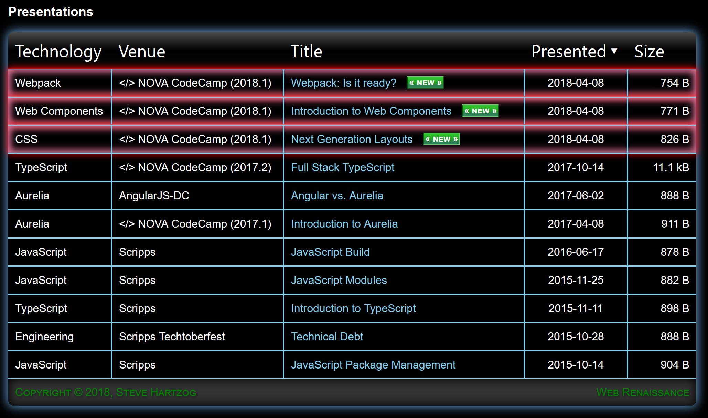

# Slides-Template

## What and Why
Tired of fighting PowerPoint or Keynote to show basic code blocks? Want a web-native presentation
template solution? One that can show code off quickly and easily with syntax highlighting,
collapsible regions, and line numbers? Or a d3 visualization? Or maybe a simple twitter embed?

Do you want everything preconfigured out of the box (a non-trivial task), but ready to extend?
Well, this is simply the fastest way to get to an in-memory, ready to run template for
tech & code presentations - especially if you :heart: TypeScript and Sass.

## Quick Start

To install the dependencies (make sure you have [Node.js](https://nodejs.org) installed before beginning) and start the application:

1. Install and Start
    ```shell
    npm install
    npm start
    ```
1. See the sample slide at: [http://localhost/presentations/index.html](http://localhost/presentations/index.html).

> Once you start creating your own slides as detailed below (under [Presentation List](#Presentation-List)), you will see them listed at [http://localhost/](http://localhost/).

## Technical Stack

Here is the tech integrated and working is this template:

1. **[Reveal.js](https://revealjs.com/#/)**: The open source slide framework used by [http://slid.es](http://slid.es), here is what is preconfigured:
    - Marked/Markdown: Built in plugin to add support markdown blocks
    - Highlight.js: Built in plugin that provides a simplistic syntax highlighting of &lt;pre&gt;&lt;code&gt;&lt;/code&gt;&lt;/pre&gt; blocks
    - Zoom.js: Built in plugin that allows speakers to alt-click a slide to zoom in
    - Speaker Notes: Built in plugin that allows speakers to press `s` to show a speaker notes view
    - Reveal.js-Menu: Adds a menu slideout (lists slides, allows theme & transition changes)
    - Reveal.js-Ace: Allows embedding an Ace editor into an iframe
    - Reveald3: Allows embedding a d3 html document into an iframe
    - Badges: Adds a language badge to Hightlight.js code blocks
    - Elapsed Time Bar: Shows a time bar above the progressbar to help with talk pacing
    - Embed Tweet: Allows embedding a tweet (totally formatted) of any given tweet url
    - addHeader(): A custom extension to show the title next to the Reveal.js-menu hamburger
    - addVenue(): A custom extension to show the venue (e.g. `</> NOVA CodeCamp 2018.1`) in the lower left corner
    - addDetailsToToast(): A custom extension to show author/title/author image in a pill (just like slid.es does)

1. **[TypeScript](https://www.typescriptlang.org/)**: JavaScript at scale is everywhere, even the `webpack.config.ts`
1. **[Sass](http://sass-lang.com/)**: CSS with superpowers
1. **[FontAwesome](http://fontawesome.io/)**: The iconic font and CSS toolkit
1. **[Ace Editor](https://ace.c9.io/)**: High performance code editor for the web, now ready to embed in your slide
   - Custom theme,  `ace-theme-aurelia-dark-plus` included matches the vscode `aurelia-dark-plus` theme by the Aurelia team
1. **[D3JS](https://d3js.org/)**: The library used to bring data to life
1. Prebuilt **`layouts`** to quickly focus on the presentation content
1. **[Webpack 3](https://webpack.js.org/)** - completely built with Webpack... *using* **TypeScript**, preconfigured with an API to
   read and serve up the local presentations with an `/api/files` endpoint
   - Uses [webpack-dev-server](https://github.com/webpack/webpack-dev-server) to serve the site in memory (no deployment)
   - Extended to serve an express route `/api/files` to list all HTML files in `/src/presentations`

## Presentation List

[https://localhost/](https://localhost/)



### Title, Author, Presented

Use &lt;meta&gt; tags & the &lt;title&gt; tag to get your presentation details to show up on the presentation list.

```html
<title>Slides Template</title>
<meta name="author" content="Steve Hartzog">
<meta name="presented" content="{Date Presented}" scheme="YYYY-MM-DD">
<meta name="venue" content="{Venue Name}">
```

### Technology

To get a technology group to show on the list, create a folder underneath `presentations`:

Group | URL Example
----- | ---
JavaScript | `/src/presentations/javascript/intro-101.html`
TypeScript | `/src/presentations/typescript/intro-101/index.html`
Webpack | `/src/presentations/webpack/webpack-501/index.html`


## Slide Configuration

### Disable Plugins

To disable one of the default plugins, add a CSV list of plugins to disable in
the `data-disable-plugins` attribute on `.slides`

```html
<div class="slides" data-disable-plugins="d3, ace">
```

> Valid Plugins to disable include: `ace, badges, d3, hljs, menu, timeBar, tweets`

### Timer

To enable a timer above your progressbar (on the bottom), just add a `data-time` attribute to your `<div class="slides">` container:

```html
<div class="slides" data-timer="15"><!-- for a 15 minute talk -->
```

### Included Layouts

What do I mean by `layouts`? I mean a style sheet (`./src/styles/layouts.scss`) with
custom slide layouts. I built a few to start (all using Flex):

1. `<section class="two-column">`: Two columns, small left (with shaded background), big right column
1. `<section class="two-row-hero">`: Two rows, large big (with shaded background, designed for a 'hero' image), smaller bottom row
1. `<section class="two-row-header">`: Two rows, small big (with shaded background), large bottom row
1. `<section class="closer">`: For an information packed final slide, 2 columns in the first row (1 image column, 1 data column), 2nd row for contact details (2 columns).

These layouts should (will shortly) work with all themes.

- More layouts to come.
- Pull requests accepted.

### Reveal.js-Menu

To add a custom slide title (by default it grabs the first h# tag), just add the
`data-menu-title` attribute on any gives `section` tag:

```html
<section data-menu-title="My Custom Title">
```

## REST Endpoint: `/api/files`

This endpoint, which is also served when you `npm start`, will show a listing of all html
files under `./src/presentations/` (except for the template slide, `./src/presentations/index.html`). 
To view what is served by this endpoint:

  - [http://localhost/api/files](http://localhost/api/files) with your browser
  - [Insomnia.rest](https://insomnia.rest/): The best REST API tester ever.